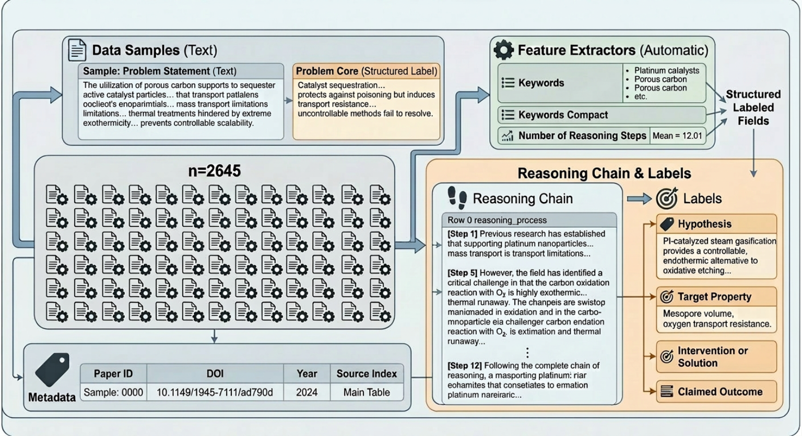

# Matter to Mechanism


**A Multi-Dimensional Benchmark for Evaluating Co-Scientist AI in Battery Materials Research**

NeurIPS 2026 Evaluations & Datasets Track (Anonymous Submission)

## Overview
BatteryHypoBench evaluates AI-generated scientific hypotheses across six
orthogonal dimensions without requiring ground-truth hypothesis matching.

## Metrics
| Metric | Description |
|--------|-------------|
| RCF | Reasoning Chain Fidelity |
| HPA | Hypothesis-Problem Alignment |
| MSI | Mechanistic Specificity Index |
| SNS | Scientific Novelty Score |
| IP  | Intervention Plausibility |
| PDQ | Problem Decomposition Quality |
| CBS | Composite Battery Science Score |

## Quick Start
```bash
pip install pandas numpy scipy nltk rouge-score bert-score sentence-transformers litellm

# Score reference hypotheses
python benchmark.py \
    --csv your_dataset.csv \
    --output results/

# Run full co-scientist benchmark
python full_benchmark.py \
    --csv your_dataset.csv \
    --sample 500 \
    --gemini-key $GEMINI_API_KEY \
    --output results/full_eval/

# Run validation experiments (2, 3, 4)
python experiments_2_3_4.py \
    --results results/analysis_final/combined_results.csv \
    --gemini-key $GEMINI_API_KEY \
    --output results/validation/ \
    --exp 2 3 4
```

## Dataset
Available on HuggingFace
## Systems Evaluated
- REFERENCE (ground truth)
- Gemini 2.5 Flash (direct + retrieval-enabled)
- Open Co-Scientist (jataware, tournament loop)
- AI-Researcher (3-stage pipeline)
- ChemDFM-8B / 13B (open-source local)
